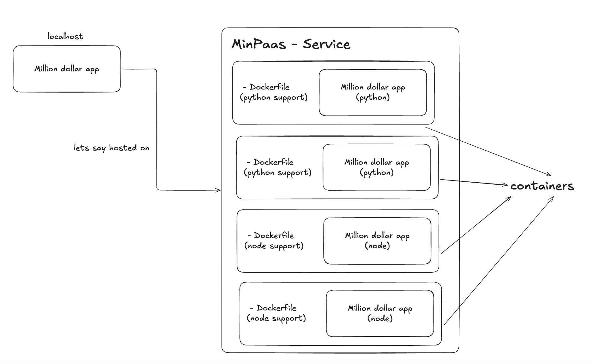

# MinPaas

**MinPaas** is a **Docker-first, single-machine Platform-as-a-Service (PaaS)** inspired by early Heroku.

It allows users to deploy applications directly from GitHub repositories and access them via **subdomain-based routing (`appname.localhost`)**, without Kubernetes.

MinPaas is intentionally minimal and built to demonstrate **real-world system design**, **container lifecycle management**, and **production thinking**.

---

## Why MinPaas?

Modern PaaS platforms hide too much.

MinPaas is designed to show:

* how a PaaS actually works internally
* how Docker, ports, and reverse proxies interact
* how control planes and data planes are separated
* how to build incrementally without overengineering

This project is optimized for:

* learning
* interviews
* resume demonstration
* infrastructure fundamentals

---

## Core Features

* GitHub-based deployments
* Docker-based execution (no Kubernetes)
* Python & Node.js runtimes
* Dynamic port allocation
* Subdomain routing via NGINX (`appname.localhost`)
* CLI interface
* REST API
* Web dashboard
* Live logs (semi-live actually, depends how well I've written Javascript)
* App lifecycle management (deploy, list, logs, delete)

---

## High-Level Architecture

### Overview



```
┌──────────────┐
│     User     │
│ CLI / UI     │
└──────┬───────┘
       │ HTTP
       ▼
┌────────────────────┐
│   MinPaas API      │
│   (FastAPI)        │
│                    │
│ - deploy logic     │
│ - registry         │
│ - nginx sync       │
└──────┬─────────────┘
       │ docker build/run
       ▼
┌────────────────────┐
│   Docker Engine    │
│                    │
│  App Containers    │
│  (python/node)     │
│                    │
│  PORT=47784        │
└──────┬─────────────┘
       │ localhost:port
       ▼
┌────────────────────┐
│       NGINX        │
│ Reverse Proxy      │
│                    │
│ app.localhost →    │
│ 127.0.0.1:PORT     │
└──────┬─────────────┘
       │
       ▼
┌────────────────────┐
│   Browser Access   │
│ appname.localhost  │
└────────────────────┘

```

### Traffic Flow

```
Browser
  |
  |  http://appname.localhost
  v
NGINX (reverse proxy)
  |
  |  proxy_pass → localhost:<dynamic-port>
  v
Docker Container
```

---

## Design Principles

* **Docker is the core abstraction**
* **Single machine**
* **No Kubernetes**
* **No magic**
* **Everything explainable**
* **Incremental complexity**
* **State is explicit**

---

## Project Structure

```
minpaas/
├── minpaas/
│   ├── server/
│   │   ├── main.py        # FastAPI app
│   │   ├── deploy.py      # build/run containers
│   │   ├── registry.py    # persistent app state
│   │   ├── nginx.py       # NGINX config generation
│   ├── cli/
│   │   ├── cli.py         # minpaas CLI
│   │   ├── api.py         # HTTP wrapper
├── nginx/
│   ├── nginx.conf         # main nginx config
│   ├── apps.map.conf     # generated routing map
│   ├── mime.types
├── state/
│   └── apps.json          # source of truth
├── workspace/             # cloned repos
├── static/                # UI assets
└── README.md
```

Note from author: Ideally the source of truth must be actual containers running, but we don't consider it because there could be a case where the container exited with some code, for eg. 1. In such cases the UI must still show the container info whether or not is running or not running to debug it.

---

## How MinPaas Works (Detailed)

### 1. Deployment Flow

When a user deploys an app:

1. Repo is cloned into `workspace/`
2. A runtime-specific Dockerfile is selected
3. Docker image is built
4. A free host port is allocated
5. Container is started with `-p host_port:container_port`
6. App metadata is written to `state/apps.json`
7. NGINX routing is regenerated
8. NGINX is reloaded

---

### 2. Runtime Model

Supported runtimes:

* **Python**
* **Node.js**

Requirements:

* App must listen on `$PORT`
* App must bind to `0.0.0.0`

Example:

```js
server.listen(process.env.PORT, "0.0.0.0");
```

---

### 3. State Management

MinPaas uses a **file-based registry**:

```json
{
  "hello-node": {
    "runtime": "node",
    "port": 47784,
    "status": "running",
    "url": "http://hello-node.localhost",
    "command": "node index.js"
  }
}
```

This registry is the **single source of truth**.

---

### 4. Reverse Proxy (NGINX)

MinPaas uses **hostname-based routing** via NGINX.

Generated file:

```nginx
map $host $upstream {
  default "";
  hello-node.localhost 127.0.0.1:47784;
  hello-python.localhost 127.0.0.1:38973;
}
```

A single wildcard server handles all apps:

```nginx
server {
  listen 80;
  server_name *.localhost;

  location / {
    if ($upstream = "") { return 404; }
    proxy_pass http://$upstream;
  }
}
```

This design:

* avoids per-app server blocks
* scales cleanly
* mirrors real ingress controllers

---

## Usage

MinPaas can be used in **three ways**:

1. CLI
2. REST API (curl)
3. Web UI

---

## 1️⃣ CLI Usage

### Start MinPaas server

```bash
uvicorn minpaas.server.main:app --port 4000
```

---

### Deploy an app

```bash
minpaas deploy \
  --app hello-node \
  --runtime node \
  --repo https://github.com/you/hello-node \
  --command "node index.js"
```

---

### List apps

```bash
minpaas apps
```

Output:

```
NAME          RUNTIME   STATUS    URL
hello-node    node      running   http://hello-node.localhost
```

---

### View logs

```bash
minpaas logs hello-node
```

---

### Delete app

```bash
minpaas delete hello-node
```

---

## 2️⃣ REST API (curl)

### Deploy

```bash
curl -X POST http://localhost:4000/deploy \
  -H "Content-Type: application/json" \
  -d '{
    "app": "hello-node",
    "runtime": "node",
    "repo": "https://github.com/you/hello-node",
    "command": "node index.js"
  }'
```

---

### List apps

```bash
curl http://localhost:4000/apps
```

---

### Logs

```bash
curl http://localhost:4000/apps/hello-node/logs
```

---

## 3️⃣ Web UI

* Visit: `http://localhost:4000`
* Deploy apps via form
* View app list
* Click `appname.localhost`
* View logs in modal
* Delete apps

The UI is intentionally minimal and operational.

---

## Constraints (By Design)

* Single machine
* No autoscaling
* No TLS
* No persistent volumes
* No Kubernetes
* No background workers

These are **intentional**, not limitations.

---

## What This Project Demonstrates

* Docker container lifecycle
* Runtime abstraction
* Reverse proxy integration
* Dynamic routing
* Control plane vs data plane
* Real PaaS architecture
* Operational debugging
* Incremental system design

---

## Future Improvements (Planned)

* Restart app
* Health checks
* Crash detection
* Auto-redeploy
* TLS via Caddy
* Custom domains
* Metrics

---

## Author

Built by **Vaibhav Shukla**